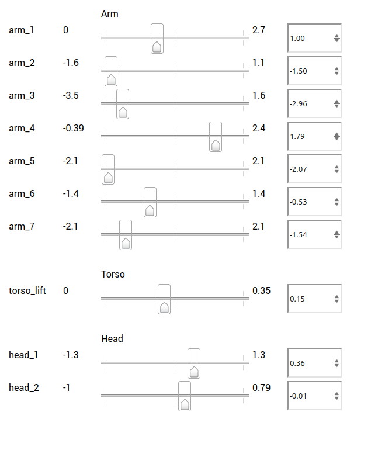

# Autonomous Door Negotiation

A research project focused on developing autonomous robotic systems capable of negotiating doors in real-world environments. This project explores challenges and solutions in door detection, handle manipulation, and successful door traversal for mobile robots.

---

## Table of Contents

- [Overview](#overview)
- [Setup and Installation](#setup-and-installation)
  - [Prerequisites](#prerequisites)
  - [ROS1 Docker Setup](#ros1-docker-setup)
  - [ROS2 Docker Setup](#ros2-docker-setup)
- [Connecting to the Robot](#connecting-to-the-robot)
- [Control Topics & Examples](#control-topics--examples)
- [License](#license)
- [References](#references)

---

## Overview

- Door detection and classification
- Handle manipulation strategies
- Autonomous navigation through doorways
- Safety considerations for robot-door interaction

---

## Setup and Installation

### Prerequisites

- Docker
- Git
- Rocker (`pip install rocker`)

---

### ROS1 Docker Setup

**Build:**
```bash
docker build -t tiago_adn_ros_noetic -f ROS1_Docker/Dockerfile ./ROS1_Docker
```
**Run:**
```bash
rocker --nvidia --x11 -- tiago_adn_ros_noetic
```

---

### ROS2 Docker Setup

**Build:**
```bash
docker build -t tiago_adn_ros2_humble -f ROS2_Docker/Dockerfile ./ROS2_Docker
```
**Run:**
```bash
rocker --nvidia --cuda --x11 -- tiago_adn_ros2_humble
```
**Source workspace:**
```bash
source /tiago_ws/install/setup.bash
```

---

## Connecting to the Robot

1. **Connect to WiFi:** Join `tiago-0c`.
2. **Web Interface:** [http://10.68.0.1:8080/](http://10.68.0.1:8080/)
3. **SSH:**
   ```bash
   ssh -oHostKeyAlgorithms=+ssh-rsa root@10.68.0.1
   ```
   > *Note: The `-oHostKeyAlgorithms=+ssh-rsa` option is required for compatibility.*

---

## Add Lerobot Fork
```bash
git clone https://github.com/Om-Kulkarni/lerobot_tiago.git
```

## Control Topics & Examples

### Arm Control

```bash
rostopic pub /arm_controller/command trajectory_msgs/JointTrajectory "header:
  seq: 26
  stamp:
    secs: 0
    nsecs: 0
  frame_id: ''
joint_names:
  - 'arm_1_joint'
  - 'arm_2_joint'
  - 'arm_3_joint'
  - 'arm_4_joint'
  - 'arm_5_joint'
  - 'arm_6_joint'
  - 'arm_7_joint'
points:
- positions: [1, -0.7457, -2.9648, 1.7901, -2.0943, -0.5314, -0.1771]
  velocities: []
  accelerations: []
  effort: []
  time_from_start:
    secs: 1
    nsecs: 8481387"
```

### Torso Control
```bash
rostopic pub /torso_controller/command trajectory_msgs/JointTrajectory "header:
  seq: 26
  stamp:
    secs: 0
    nsecs: 0
  frame_id: ''
joint_names:
  - 'torso_lift_joint'
points:
- positions: [0.1]
  velocities: []
  accelerations: []
  effort: []
  time_from_start:
    secs: 1
    nsecs: 1"
```

### Head Control
```bash
rostopic pub /head_controller/command trajectory_msgs/JointTrajectory "header:
  seq: 0
  stamp:
    secs: 0
    nsecs: 0
  frame_id: ''
joint_names:
  - 'head_1_joint'
  - 'head_2_joint'
points:
- positions: [1.0,-0.6]
  velocities: []
  accelerations: []
  effort: []
  time_from_start:
    secs: 1
    nsecs: 8481387"
```

### Gripper Control
- **Max:** `[0.053, 0.052]`
- **Min:** `[-0.008, -0.008]`
```bash
rostopic pub /gripper_controller/command trajectory_msgs/JointTrajectory "header:
  seq: 0
  stamp:
    secs: 0
    nsecs: 0
  frame_id: ''
joint_names:
  - 'gripper_right_finger_joint'
  - 'gripper_left_finger_joint'
points:
- positions: [0.05,0.05]
  velocities: []
  accelerations: []
  effort: []
  time_from_start:
    secs: 1
    nsecs: 8481387"
```

### Base Control
- **Rotate Z:** `angular.z: -0.3` or `0.3`
- **Move Forward/Backward:** `linear.x: 0.2` or `-0.2`
```bash
rostopic pub -r 15 /mobile_base_controller/cmd_vel geometry_msgs/Twist "linear:
  x: 0.0
  y: 0.0
  z: 0.0
angular:
  x: 0.0
  y: 0.0
  z: -0.3"
```

---

## License

MIT License - see [LICENSE](LICENSE).

---

## References

- [Rulebook & Papers](Papers/Rulebook/)
- [Images](Images/)

### 3. SSH into the Robot

Use the following command to connect via SSH:

```bash
ssh -oHostKeyAlgorithms=+ssh-rsa root@10.68.0.1
```

> **Note:** The `-oHostKeyAlgorithms=+ssh-rsa` option is required for compatibility with the robot's SSH server.


## License

This project is licensed under the MIT License - see the [LICENSE](LICENSE) file for details.


## ARM topics

```bash
/arm_controller/command
/arm_controller/follow_joint_trajectory/cancel
/arm_controller/follow_joint_trajectory/feedback
/arm_controller/follow_joint_trajectory/goal
/arm_controller/follow_joint_trajectory/result
/arm_controller/follow_joint_trajectory/status
/arm_controller/safe_command
/arm_controller/state
/arm_current_limit_controller/command
/arm_current_limit_controller/state

```

## SAMPLE:

/home/pal/tutorials_ws/src/

## EXAMPLES


ARM CONTROL(REFER LIMITS FROM WEBPAGE)
```bash
rostopic pub /arm_controller/command trajectory_msgJointTrajectory "header:
  seq: 26
  stamp:
    secs: 0
    nsecs: 0
  frame_id: ''
joint_names:
  - 'arm_1_joint'
  - 'arm_2_joint'
  - 'arm_3_joint'
  - 'arm_4_joint'
  - 'arm_5_joint'
  - 'arm_6_joint'
  - 'arm_7_joint'
points:
- positions: [1, -0.7457, -2.9648, 1.7901, -2.0943, -0.5314, -0.1771]
  velocities: []
  accelerations: []
  effort: []
  time_from_start:
    secs: 1
    nsecs: 8481387"
```

TORSO CONTROL(REFER LIMITS FROM WEBPAGE)
```bash
 rostopic pub /torso_controller/command  trajectory_gs/JointTrajectory "header:
  seq: 26
  stamp:
    secs: 0
    nsecs: 0
  frame_id: ''
joint_names:
  - 'torso_lift_joint'
points:
- positions: [0.1]
  velocities: []
  accelerations: []
  effort: []
  time_from_start:
    secs: 1
    nsecs: 1"

```
HEAD CONTROL(REFER LIMITS FROM WEBPAGE)

```bash
rostopic pub /head_controller/command trajectory_msgs/JointTrajectory "header:
  seq: 0
  stamp:
    secs: 0
    nsecs: 0
  frame_id: ''
joint_names:
  - 'head_1_joint'
  - 'head_2_joint'
points:
- positions: [1.0,-0.6]
  velocities: []
  accelerations: []
  effort: []
  time_from_start:
    secs: 1
    nsecs: 8481387"
```

GRIPPER CONTROL


gripper limits:

Maximum:

positions: [0.053180563895850796, 0.05262160242463829]

Minimum:

positions: [-0.008305216756601662, -0.008124320836811796]

```bash
rostopic pub /gripper_controller/command trajectory_msgs/JointTrajectory "header:
  seq: 0
  stamp:
    secs: 0
    nsecs: 0
  frame_id: ''
joint_names:
  - 'gripper_right_finger_joint'
  - 'gripper_left_finger_joint'
points:
- positions: [0.05,0.05]
  velocities: []
  accelerations: []
  effort: []
  time_from_start:
    secs: 1
    nsecs: 8481387"
```

BASE CONTROL:

Topics to control the base

Rotate around Z axis (set speed to -0.3 or 0.3  for clockwise and anticlockwise )
Moving forward change the linear x(set speed 0.2 or -0.2 to move forward or backward)

```bash
rostopic pub -r 15 /mobile_base_controller/cmd_vel geometry_msgs/Twist "linear:
  x: 0.0
  y: 0.0
  z: 0.0
angular:
  x: 0.0
  y: 0.0
  z: -0.3"
```

/home/pal/tiago_adn_ws/src/tiago_moveit_tutorial/src
rosrun tiago_moveit_tutorials

Coordinate limits wrt base_footprint
x > 0.2
- < y < +
z > 0.1

gpt_socket_ik2.py


export __GLX_VENDOR_LIBRARY_NAME=nvidia
export __NV_PRIME_RENDER_OFFLOAD=1


tiago_ik_prahalad.py is the joystick control
tiago_ik_working.py is pranav's simulationsetup
tiago_fk.py and tiago_pytbullet.py are hopefully the same but one of the is surely fk


# Om's Code for Sim to real teleoperation
sim_ik_client.py: The simulation and client side code that updates the simulation and the sends the joint state
to the real robot
socket_server.py: The server side code which uses rostopic lists to send joint commands to the real robot

# Joystick control and calibration
```bash
jstest-gtk
```

joystick_test.py: Script to print out button indexes to confirm whether they match the ones seen in jstest-gtk

# Tiago Joystick Control Scheme

This simulation uses a dual-mode control system, allowing for a clear separation between driving the robot's base and manipulating its arm.

**Press the `SELECT` button on the controller to toggle between the two modes.**

---

### Mode 1: Base Control

In this mode, the controller is dedicated to driving the robot's base. The arm remains stationary.

| Action             | Controller Input |
| ------------------ | ---------------- |
| Move & Turn Base   | **Left Stick** |
| (Arm is stationary) | (Other inputs inactive) |

---

### Mode 2: Arm Control

In this mode, the robot's base is stationary, and the controller is fully dedicated to positioning the end-effector.

| Action                                     | Controller Input        |
| ------------------------------------------ | ----------------------- |
| **Position** (`X`/`Y`): Forward/Back & L/R | **Left Stick**          |
| **Position** (`Z`): Up/Down                | **D-Pad** Up/Down       |
| **Orientation** (`Pitch`/`Yaw`): Nod/Turn  | **Right Stick**         |
| **Orientation** (`Roll`): Twist            | **R2 / L2 Buttons**     |


## Tiago Files for Lerobot Framework

The tiago files have been rewritten to follow the Lerobot Framework.
Tiago/tiago_host.py:    Handles the TCP connection with the client. (Lives in the robot)
Tiago/tiago.py:         Handles the ROS communication to move the robot base and the arm. (Lives in the robot)
Tiago/tiago_client.py:  Handles The communication with the host. has all the functions to follow the Lerobot Framework.
